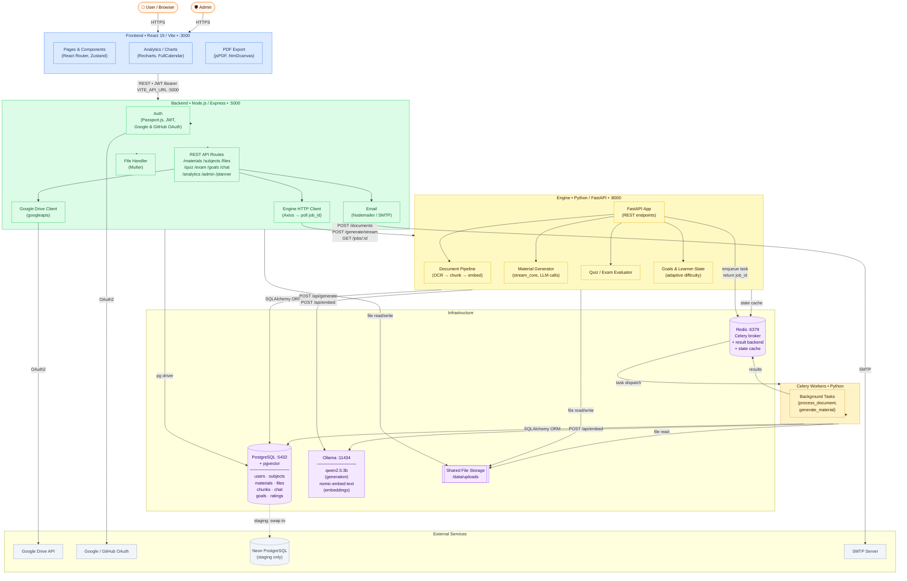

# Cognify — High-Level Architecture



---

## Component Summary

| Layer | Service | Tech | Port |
|-------|---------|------|------|
| **Presentation** | Frontend | React 19, Vite, Zustand, Tailwind | 3000 |
| **API** | Backend | Node.js, Express, Passport.js, JWT | 5000 |
| **AI Processing** | Engine | Python, FastAPI, SQLAlchemy | 8000 |
| **Async Workers** | Celery Workers | Python, Celery 5 | — |
| **Database** | PostgreSQL + pgvector | pg16 + pgvector | 5432 |
| **Cache / Queue** | Redis | redis:7-alpine | 6379 |
| **LLM Runtime** | Ollama | qwen2.5:3b, nomic-embed-text | 11434 |
| **External** | Google OAuth / Drive | googleapis | — |

## Key Data Flows

### 1 — Document Upload & Processing
```
User uploads file
  → Frontend (multipart form)
  → Backend /api/files (Multer stores to /data/uploads)
  → Backend → Engine POST /documents
  → Engine enqueues Celery task via Redis
  → Worker: OCR → chunk → embed (Ollama) → store in PG (chunks+vectors)
  → Backend polls GET /jobs/:id until COMPLETED
  → Frontend shows "ready to generate"
```

### 2 — Material Generation (streaming)
```
User clicks "Generate Summary / Quiz / Flashcards"
  → Frontend SSE / fetch stream
  → Backend POST /api/materials/:id/generate
  → Backend → Engine POST /generate/stream
  → Engine retrieves relevant chunks from PG (vector similarity)
  → Engine streams LLM tokens from Ollama
  → Backend pipes stream → Frontend
  → Frontend renders content in real-time
  → Backend saves final content to PG
```

### 3 — Adaptive Learning Loop
```
User answers quiz / exam
  → Backend records event → Engine POST /goals/learning-events
  → Engine updates learner-state in PG + caches snapshot in Redis
  → Engine returns next recommended difficulty / topic
  → Frontend adjusts next quiz / suggests materials
```
