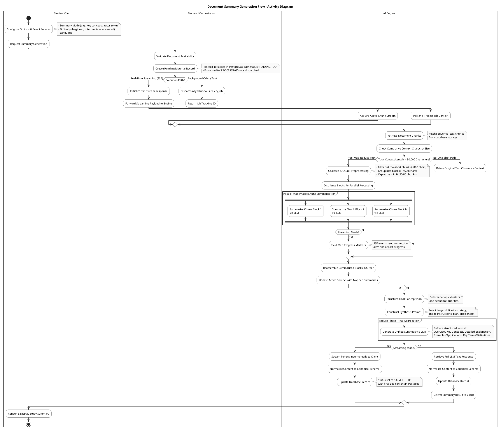

# Cognify Backend Summary Generation Flow

This document details the architecture and execution flow for summary generation in the Cognify backend. It explains the dual-path execution model, details the chunk processing stages (Map and Reduce), and provides a clean, academic-style PlantUML activity diagram for use in technical reports.

---

## Execution Flow & Orchestration

The Cognify platform employs a RAG (Retrieval-Augmented Generation) pipeline specifically optimized for generating study summaries. The process begins with a user-initiated request containing source documents, summary options, and optionally a specific topic. The orchestrator routes the request along one of two primary pathways depending on the client's needs:

1. **Streaming Path (Real-time SSE)**: Bypasses Celery and initiates an immediate HTTP stream. It uses asynchronous processing to feed progress updates to the client and stream tokens as they are generated by the local LLM.
2. **Asynchronous Path (Celery Worker)**: Dispatches a background job to a Celery task queue and returns a job tracking ID. The client polls the status of this job until completion.

### 1. Retrieval of Context (RAG)
For the target subject or material list:
- Chunks of text are retrieved from PostgreSQL.
- If a specific topic is specified, semantic vector retrieval (using `nomic-embed-text` embeddings stored via `pgvector`) is performed to select the top-K relevant chunks.
- If no specific topic is specified, chunks are retrieved sequentially to maintain document structure.

### 2. Context Processing & The Map Phase
The character count of all retrieved chunks determines the processing path:
- **One-Shot Path ($\le 30,000$ characters)**: The text is consolidated and forwarded directly to the synthesis (Reduce) phase.
- **Map-Reduce Path ($> 30,000$ characters)**: Triggered when the content exceeds the one-shot threshold to avoid context window truncation and LLM degradation.
  - **Chunk Coalescing**: Eligible chunks (excluding empty or very short snippets) are merged into logical blocks of approximately 4,500 characters.
  - **Parallel Chunk Summarization (Map)**: A thread pool processes these blocks concurrently. Each block is summarized by the LLM using a mode-specific prompt (e.g., bulleted points, conversational extraction, key concept extraction).
  - **Progress Feedback**: In the streaming path, progress updates (e.g., `map 3/10`) are sent to the client to maintain the connection.
  - **Reassembly**: The summarized blocks are reassembled in chronological order.

### 3. Concept Planning & The Reduce Phase
The consolidated context (either the raw sequential chunks or the mapped summaries) is then synthesized into the final output:
- **Concept Planner**: Generates a unified structure (concept plan) out of the active context to identify core themes and sequence logical relationships.
- **Final Synthesis (Reduce)**: The system combines the target difficulty strategy, selected summary mode instructions, the concept plan, and the context text. A strict structural system prompt enforces standard academic sections:
  1. *Overview*
  2. *Key Concepts*
  3. *Detailed Explanation*
  4. *Examples / Applications*
  5. *Key Terms / Definitions*
- **Streaming/Returning Output**: The final LLM response is returned either incrementally via SSE or saved as a single response in the database.
- **Normalization & Database Sync**: The raw LLM response is parsed and normalized to fit the database schema before the material record is updated to a terminal `COMPLETED` status.

---

## PlantUML Activity Diagram

